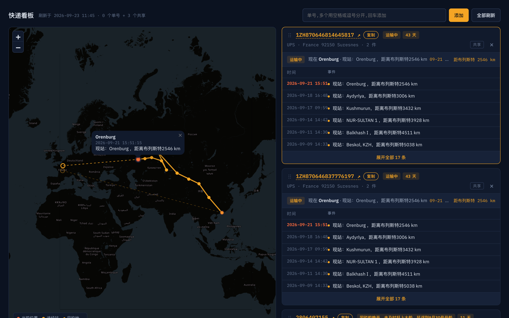

# Parcel Tracker

[中文说明](README.zh-CN.md)

A single-page dashboard for parcels riding the China–Europe rail corridor: one map with every route, one card per tracking number with the full event timeline.

Live: https://yuuteng.github.io/parcel-tracker/



## Features

- Three lookup sources tried in order: nextsls, itdida, then 17TRACK through a Cloudflare Worker.
- One OpenStreetMap map for all parcels. The selected route is highlighted, the others are dimmed. Clicking a card focuses its route and opens the current position.
- Each card shows the tracking number (linked to the carrier site), a copy button, status and days in transit, carrier, destination and parcel count, then the latest event and a collapsible event table.
- Station names are geocoded once through Nominatim and cached in the browser. Common rail stations are hardcoded so the first paint needs no lookups.
- Drag the handle to reorder cards. The order is remembered.
- Shared numbers come from `numbers.json` and appear for everyone. Personal numbers live in the browser and in the URL hash (`#n=A,B,C`), so a link carries the list.
- Shared numbers can be hidden per device and restored from the header.
- Dark and light themes follow the system. Touch devices get a map lock so the page scrolls instead of the map.

## Layout

| Path | Purpose |
|------|---------|
| `index.html` | The whole app: styles, data layer, map and cards |
| `numbers.json` | Shared tracking numbers, `{"shared": [...]}` |
| `worker/` | Cloudflare Worker that relays 17TRACK with the API key kept server-side, plus its deploy script |
| `demo/` | Earlier layout mockups |

## Updating

- Shared numbers: edit `numbers.json`, commit, push. GitHub Pages redeploys within a minute.
- Worker: see `worker/README.md`. Credentials stay outside the repo.

## Running locally

```sh
python3 -m http.server 8000
```

Open http://localhost:8000/. The page calls the tracking APIs directly from the browser.

## Notes

Personal project. Tracking data belongs to the respective carriers and forwarders.
