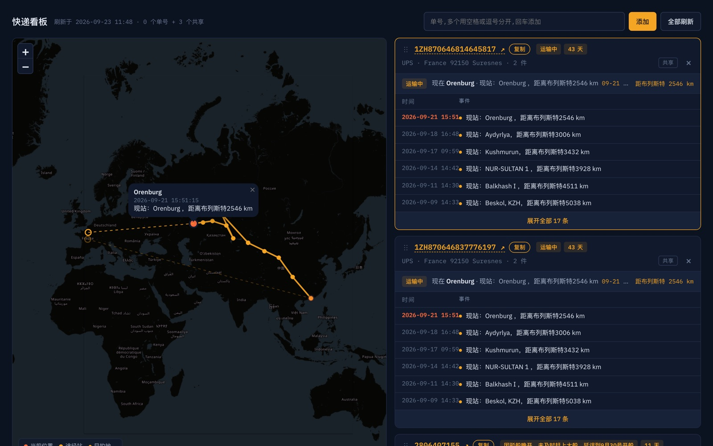

# 快递看板

[English](README.md)

中欧班列包裹的单页看板:一张地图画出所有线路,每个单号一张卡片,带完整轨迹。

线上地址:https://yuuteng.github.io/parcel-tracker/



## 功能

- 三个查询源按顺序尝试:nextsls、itdida,最后通过 Cloudflare Worker 查 17TRACK。
- 所有包裹画在同一张 OpenStreetMap 地图上,选中的线路高亮,其它淡化。点卡片聚焦到该线路并弹出当前位置。
- 卡片标题行:单号(点开承运商官网)、复制、状态和在途天数、承运商、目的地、件数;下面是最新一条事件和可展开的轨迹表。
- 站名通过 Nominatim 定位一次后缓存在浏览器里,常见班列站点写死在代码里,首屏不用等定位。
- 拖动把手调整卡片顺序,顺序会记住。
- 共享单号来自 `numbers.json`,所有人可见;个人单号存在浏览器和 URL hash(`#n=A,B,C`)里,发链接就是发列表。
- 共享单号可以在本设备隐藏,顶部一键恢复。
- 深浅色跟随系统。触屏设备有地图锁,避免滑页面时拖到地图。

## 目录

| 路径 | 作用 |
|------|------|
| `index.html` | 整个应用:样式、数据层、地图和卡片 |
| `numbers.json` | 共享单号,`{"shared": [...]}` |
| `worker/` | 转发 17TRACK 的 Cloudflare Worker,API key 留在服务端;含部署脚本 |
| `demo/` | 早期的布局样稿 |

## 更新

- 共享单号:改 `numbers.json`,commit,push。GitHub Pages 一分钟内生效。
- Worker:见 `worker/README.md`。凭据不进仓库。

## 本地运行

```sh
python3 -m http.server 8000
```

打开 http://localhost:8000/,页面直接从浏览器调各家查询接口。

## 说明

个人项目。物流数据归各承运商和货代所有。
